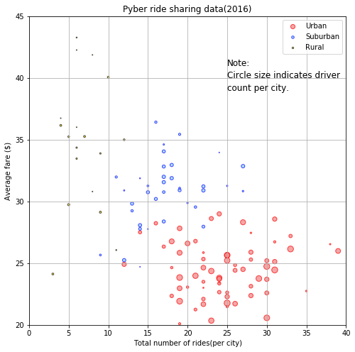
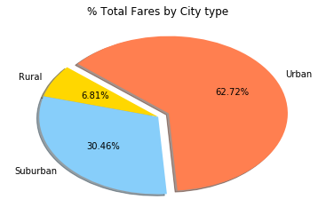
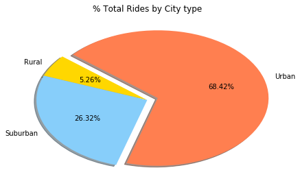
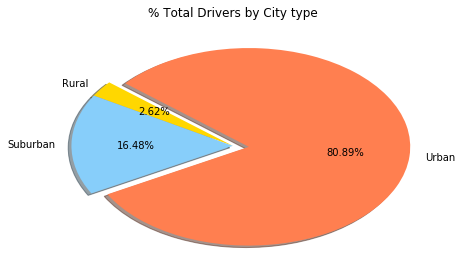

## Observable Trends
#Most rides and drivers are in the Urban areas and the average fares are also significantly less in the urban cities.
#The Rural areas do not have enough coverage for the rides and there is good scope for ride service provided the fares can be kept reasonable. 
#Suburban areas have higher average costs per ride and has more drivers than rural, but still much lesser than the urban cities. 
#There is a significant variation in average fares for Urban, Suburban and Rural cities. 


```python
# Import relevant libraries
#%matplotlib notebook
import pandas as pd
import numpy as np
import seaborn as sns
import matplotlib.pyplot as plt

```


```python
#Read the ride_data and city_data csv files into pandas dataframes. 
ride_df = pd.read_csv("raw_data/ride_data.csv")
city_df = pd.read_csv("raw_data/city_data.csv")
print(ride_df.head(3))
print(city_df.head(3))
#ride_city_df.dtypes
```

                     city                 date   fare        ride_id
    0  Lake Jonathanshire  2018-01-14 10:14:22  13.83  5739410935873
    1  South Michelleport  2018-03-04 18:24:09  30.24  2343912425577
    2  Port Samanthamouth  2018-02-24 04:29:00  33.44  2005065760003
               city  driver_count   type
    0   Richardfort            38  Urban
    1  Williamsstad            59  Urban
    2   Port Angela            67  Urban
    


```python
#Merge the two dataframes on city.
ride_city_df = pd.merge(ride_df,city_df,on="city")
ride_city_df.head()

```


<div>
<style>
    .dataframe thead tr:only-child th {
        text-align: right;
    }

    .dataframe thead th {
        text-align: left;
    }

    .dataframe tbody tr th {
        vertical-align: top;
    }
</style>
<table border="1" class="dataframe">
  <thead>
    <tr style="text-align: right;">
      <th></th>
      <th>city</th>
      <th>date</th>
      <th>fare</th>
      <th>ride_id</th>
      <th>driver_count</th>
      <th>type</th>
    </tr>
  </thead>
  <tbody>
    <tr>
      <th>0</th>
      <td>Lake Jonathanshire</td>
      <td>2018-01-14 10:14:22</td>
      <td>13.83</td>
      <td>5739410935873</td>
      <td>5</td>
      <td>Urban</td>
    </tr>
    <tr>
      <th>1</th>
      <td>Lake Jonathanshire</td>
      <td>2018-04-07 20:51:11</td>
      <td>31.25</td>
      <td>4441251834598</td>
      <td>5</td>
      <td>Urban</td>
    </tr>
    <tr>
      <th>2</th>
      <td>Lake Jonathanshire</td>
      <td>2018-03-09 23:45:55</td>
      <td>19.89</td>
      <td>2389495660448</td>
      <td>5</td>
      <td>Urban</td>
    </tr>
    <tr>
      <th>3</th>
      <td>Lake Jonathanshire</td>
      <td>2018-04-07 18:09:21</td>
      <td>24.28</td>
      <td>7796805191168</td>
      <td>5</td>
      <td>Urban</td>
    </tr>
    <tr>
      <th>4</th>
      <td>Lake Jonathanshire</td>
      <td>2018-01-02 14:14:50</td>
      <td>13.89</td>
      <td>424254840012</td>
      <td>5</td>
      <td>Urban</td>
    </tr>
  </tbody>
</table>
</div>


```python
#Split into 3 categories for later use in plotting as separate colors. Could not find a way to separate by type colors
#when it is groups together into cities for matplotlib. 
ride_city_df_gp_urban = ride_city_df.loc[ride_city_df["type"]=="Urban"]
ride_city_df_gp_suburban = ride_city_df.loc[ride_city_df["type"]=="Suburban"]
ride_city_df_gp_rural = ride_city_df.loc[ride_city_df["type"]=="Rural"]

```


```python
print(ride_city_df_gp_urban.head(3))
print(ride_city_df_gp_suburban.head(3))
print(ride_city_df_gp_rural.head(3))
```

                     city                 date   fare        ride_id  \
    0  Lake Jonathanshire  2018-01-14 10:14:22  13.83  5739410935873   
    1  Lake Jonathanshire  2018-04-07 20:51:11  31.25  4441251834598   
    2  Lake Jonathanshire  2018-03-09 23:45:55  19.89  2389495660448   
    
       driver_count   type  
    0             5  Urban  
    1             5  Urban  
    2             5  Urban  
                   city                 date   fare        ride_id  driver_count  \
    1625  Barronchester  2018-01-27 03:08:01  27.79  6653622887913            11   
    1626  Barronchester  2018-05-05 04:03:11  30.38  2281522828169            11   
    1627  Barronchester  2018-04-25 19:11:43  36.13  2660177707065            11   
    
              type  
    1625  Suburban  
    1626  Suburban  
    1627  Suburban  
                    city                 date   fare        ride_id  driver_count  \
    2250  Randallchester  2018-04-13 11:13:31  43.22  1076079536213             9   
    2251  Randallchester  2018-02-19 03:52:47  58.55  8004803682564             9   
    2252  Randallchester  2018-02-11 05:42:29  25.78  9010611749008             9   
    
           type  
    2250  Rural  
    2251  Rural  
    2252  Rural  
    


```python
#Count of rides per type, city and average fare per type,city. 
#ride_city_df_group = ride_city_df.groupby("city")
#ride_city_df_ridecnt = ride_city_df_group["ride_id"].count()
#ride_city_df_ridecnt.head(5)
ride_city_df_group_urban = ride_city_df_gp_urban.groupby("city")
ride_city_df_ridecnt_urban = ride_city_df_group_urban["ride_id"].count()
ride_city_df_avgfare_urban = ride_city_df_group_urban["fare"].mean()
#For suburban
ride_city_df_group_suburban = ride_city_df_gp_suburban.groupby("city")
ride_city_df_ridecnt_suburban = ride_city_df_group_suburban["ride_id"].count()
ride_city_df_avgfare_suburban = ride_city_df_group_suburban["fare"].mean()
#for Rural
ride_city_df_group_rural = ride_city_df_gp_rural.groupby("city")
ride_city_df_ridecnt_rural = ride_city_df_group_rural["ride_id"].count()
ride_city_df_avgfare_rural = ride_city_df_group_rural["fare"].mean()
```


```python
#print to view results.
print(ride_city_df_ridecnt_urban.tail(3))
print(ride_city_df_ridecnt_suburban.tail(3))
print(ride_city_df_ridecnt_rural.head(3))
#print avg fares for review and verification. 
print(ride_city_df_avgfare_urban.head(3))
print(ride_city_df_avgfare_suburban.head(3))
print(ride_city_df_avgfare_rural.head(3))
```

    city
    West Samuelburgh    25
    Williamsstad        23
    Williamsview        20
    Name: ride_id, dtype: int64
    city
    West Hannah        21
    West Kimmouth      20
    Williamsonville    14
    Name: ride_id, dtype: int64
    city
    Bradshawfurt      10
    Garzaport          3
    Harringtonfort     6
    Name: ride_id, dtype: int64
    city
    Amandaburgh    24.641667
    Barajasview    25.332273
    Carriemouth    28.314444
    Name: fare, dtype: float64
    city
    Barronchester    36.422500
    Bethanyland      32.956111
    Brandonfort      35.437368
    Name: fare, dtype: float64
    city
    Bradshawfurt      40.064000
    Garzaport         24.123333
    Harringtonfort    33.470000
    Name: fare, dtype: float64
    


```python
#number of Drivers per type, city 
city_df_urban = city_df.loc[city_df["type"]=="Urban"]
city_df_suburban = city_df.loc[city_df["type"]=="Suburban"]
city_df_rural = city_df.loc[city_df["type"]=="Rural"]


```


```python
print(city_df_urban.head(3))
print(city_df_suburban.head(3))
print(city_df_rural.head(3))

```

               city  driver_count   type
    0   Richardfort            38  Urban
    1  Williamsstad            59  Urban
    2   Port Angela            67  Urban
              city  driver_count      type
    66  Port Shane             7  Suburban
    67    Lake Ann             3  Suburban
    68  Lake Scott            23  Suburban
                   city  driver_count   type
    102  South Jennifer             7  Rural
    103    West Heather             4  Rural
    104      Newtonview             1  Rural
    


```python
#Use sum incase data is such that there are multiple rows per city with a driver count in city_df. 
city_df_urban_groupbycity = city_df_urban.groupby("city")
city_df_urban_drivercnt = city_df_urban_groupbycity["driver_count"].sum()
#Driver count for suburban
city_df_suburban_groupbycity = city_df_suburban.groupby("city")
city_df_suburban_drivercnt = city_df_suburban_groupbycity["driver_count"].sum()
#Driver count for rural
city_df_rural_groupbycity = city_df_rural.groupby("city")
city_df_rural_drivercnt = city_df_rural_groupbycity["driver_count"].sum()
```


```python
print(city_df_urban_drivercnt.head(3))
print(city_df_suburban_drivercnt.head(3))
print(city_df_rural_drivercnt.head(3))
```

    city
    Amandaburgh    12
    Barajasview    26
    Carriemouth    52
    Name: driver_count, dtype: int64
    city
    Barronchester    11
    Bethanyland      22
    Brandonfort      10
    Name: driver_count, dtype: int64
    city
    Bradshawfurt      7
    Garzaport         7
    Harringtonfort    4
    Name: driver_count, dtype: int64
    


```python
#plot the values determined above as a bubble chart.
plt.figure(figsize=(8,8))
#plot values for urban
plt.scatter(ride_city_df_ridecnt_urban,ride_city_df_avgfare_urban,s=city_df_urban_drivercnt,alpha=0.7,
            marker='o',facecolors=["Lightcoral"],edgecolors=["Red"],label="Urban")
#Plot values for suburban.
plt.scatter(ride_city_df_ridecnt_suburban,ride_city_df_avgfare_suburban,s=city_df_suburban_drivercnt,
            alpha=0.7,marker='o',facecolors=["Lightskyblue"],edgecolors=["blue"],label="Suburban")  
#Plot values for Rural.
plt.scatter(ride_city_df_ridecnt_rural,ride_city_df_avgfare_rural,s=city_df_rural_drivercnt,
            alpha=0.7,marker='o',facecolors=["Gold"],edgecolors=["Black"],label="Rural") 
                      
##plt.scatter(ride_city_df_ridecnt,ride_df_averagefare,marker='o',facecolors=["gold","Lightskyblue","Lightcoral"],
##            s=city_df_drivercnt,alpha=0.5)
#plt.scatter(x_axis, data, marker="o", facecolors="red", edgecolors="black",s=x_axis, alpha=0.75)
plt.xlim(0,40)
plt.ylim(20,45)
#plt.tight_layout()
plt.title("Pyber ride sharing data(2016)")
plt.xlabel("Total number of rides(per city)")
plt.ylabel("Average fare ($)")
plt.legend(loc='upper right')
plt.grid()
plt.text(25, 41, "Note:", fontsize=12)
plt.text(25, 40, "Circle size indicates driver", fontsize=12)
plt.text(25, 39, "count per city.", fontsize=12)
#plt.hlines(0, 0, 10, alpha=0.25)   
#Wedge percentages
#Wedge labels
plt.savefig('pyber_bubbleplot.pdf')
plt.show()

```





```python
#Determine  % of total fares by city type
ride_city_df2 = ride_city_df
ride_city_df2_totalsbytype = ride_city_df2.groupby("type")["fare"].sum()
ride_city_df2_totalsbytype
#total_alltypes = ride_city_df2_totalsbytype.sum()
#total_alltypes 
#ride_city_typepercent = (ride_city_df2_totalsbytype / total_alltypes) * 100
#ride_city_typepercent
```


    type
    Rural        4327.93
    Suburban    19356.33
    Urban       39854.38
    Name: fare, dtype: float64


```python
#Create and show  pie chart for Total fares by city type.
explode = (0, 0, 0.1)
labels=("Rural","Suburban","Urban")
colors=("Gold","Lightskyblue","Coral")
plt.pie(ride_city_df2_totalsbytype, explode=explode, labels=labels, colors=colors,
        autopct="%1.2f%%", shadow=True, startangle=140)
plt.title("% Total Fares by City type")
plt.savefig('pyber_faresbycitytype.pdf')
plt.show()

```





```python
#Determine Total rides by city type.
ride_city_df3 = ride_city_df
ride_city_df2_totalridesbytype = ride_city_df2.groupby("type")["ride_id"].count()
ride_city_df2_totalridesbytype
```


    type
    Rural        125
    Suburban     625
    Urban       1625
    Name: ride_id, dtype: int64


```python
#Create and show  pie chart for Total rides by city type.
explode = (0, 0, 0.1)
labels=("Rural","Suburban","Urban")
colors=("Gold","Lightskyblue","Coral")
plt.pie(ride_city_df2_totalridesbytype, explode=explode, labels=labels, colors=colors,
        autopct="%1.2f%%", shadow=True, startangle=140)
plt.title("% Total Rides by City type")
plt.tight_layout()
plt.savefig('pyber_ridesbycitytype.pdf')
plt.show()
```





```python
#Determine Drivers rides by city type.
city_df2 = city_df
city_df2_drivercntbytype = city_df2.groupby("type")["driver_count"].sum()
city_df2_drivercntbytype 
```


    type
    Rural         78
    Suburban     490
    Urban       2405
    Name: driver_count, dtype: int64


```python
#Create and show  pie chart for Total rides by city type.
explode = (0, 0, 0.1)
labels=("Rural","Suburban","Urban")
colors=("Gold","Lightskyblue","Coral")
plt.pie(city_df2_drivercntbytype, explode=explode, labels=labels, colors=colors,
        autopct="%1.2f%%", shadow=True, startangle=140)
plt.title("% Total Drivers by City type")
plt.tight_layout()
plt.savefig('pyber_Driversbycitytype.pdf')
plt.show()
```




